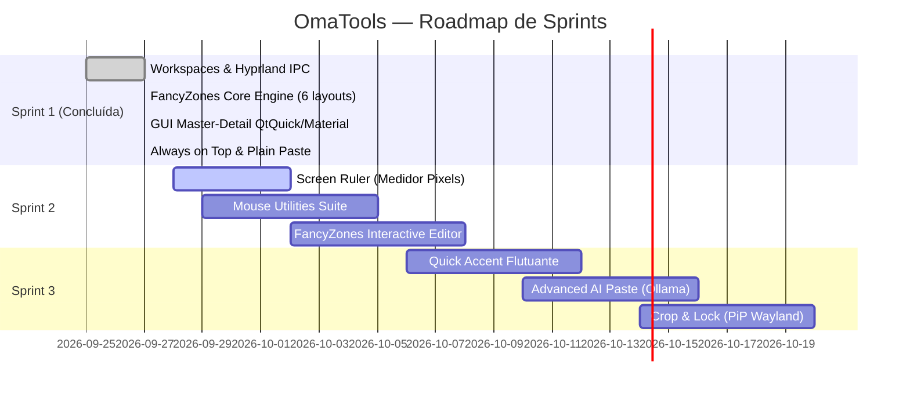

# OmaTools — Catálogo de Funcionalidades & Roadmap de Implementação

> **OmaTools**: Suíte completa de utilitários de produtividade para **Omarchy / Linux** (Wayland / Hyprland), inspirada no **Microsoft PowerToys** e desenvolvida em **Rust 2024** sob licença **Apache-2.0**, com interface nativa em **Qt6 / QtQuick (Material)** alinhada às diretrizes de design **Omacom**.

---

## 📊 Matriz de Funcionalidades (PowerToys ➔ OmaTools)

| # | Ferramenta PowerToys | Módulo OmaTools | Descrição & Arquitetura Técnica | Status |
|---|----------------------|-----------------|---------------------------------|--------|
| 1 | **FancyZones** | `omatools zones` | Encaixe de janelas em grids e zonas calculadas via Hyprland IPC | 🟢 Entregue (v0.1) / 🟡 Editor Visual pendente |
| 2 | **Workspaces** | `omatools workspaces` | Snapshot e restauração de arranjos de telas e apps via IPC | 🟢 Entregue (v0.1) |
| 3 | **Always on Top** | `omatools pin` | Fixa e flutua janelas ativas no topo de todas as outras | 🟢 Entregue (v0.1) |
| 4 | **Color Picker** | `omatools picker` | Conta-gotas sob o cursor com cópia HEX e zoom | 🟢 Entregue (v0.1) |
| 5 | **Text Extractor** | `omatools ocr` | Recorte de tela e extração de texto OCR para clipboard | 🟢 Entregue (v0.1) |
| 6 | **Paste as Plain Text**| `omatools paste-plain` | Limpa formatação rica (HTML/RTF) e cola apenas texto puro | 🟢 Entregue (v0.1) |
| 7 | **Awake** | `omatools awake` | Inibidor de suspensão e desligamento de tela | 🟢 Entregue (v0.1) |
| 8 | **File Locksmith** | `omatools locksmith` | Identifica quais processos estão bloqueando um arquivo | 🟢 Entregue (v0.1) |
| 9 | **Shortcut Guide** | `omatools guide` | Matriz e guia de atalhos PowerToys vs. OmaTools | 🟢 Entregue (v0.1) |
| 10 | **OmaTools Control Center** | `omatools gui` | Interface visual Master-Detail QtQuick/Material com IPC local | 🟢 Entregue (v0.1) |
| 11 | **Screen Ruler** | `omatools ruler` | Régua e medidor de distâncias e caixas delimitadoras em pixels | 🟡 Sprint 2 |
| 12 | **Find My Mouse** | `omatools mouse-find` | Efeito holofote ao redor do cursor ao pressionar tecla | 🟡 Sprint 2 |
| 13 | **Mouse Highlighter**| `omatools mouse-high` | Destaque visual colorido para cliques do mouse | 🟡 Sprint 2 |
| 14 | **Mouse Jump** | `omatools mouse-jump` | Mini-mapa de monitores para teletransporte do cursor | 🟡 Sprint 2 |
| 15 | **Mouse Crosshairs** | `omatools crosshairs` | Mira cartesiana de precisão centrada no ponteiro | 🟡 Sprint 2 |
| 16 | **Quick Accent** | `omatools accent` | Menu flutuante de caracteres com acentos ao segurar tecla | 🟡 Sprint 3 |
| 17 | **Crop and Lock** | `omatools crop` | Janela Picture-in-Picture de recorte interativo | 🟡 Sprint 3 |
| 18 | **Peek** | `omatools peek` | Pré-visualização rápida de arquivos (imagem, markdown, código) | 🟡 Sprint 3 |
| 19 | **Advanced AI Paste** | `omatools ai-paste` | Transformação de texto na clipboard via LLM local (Ollama) | 🟡 Sprint 3 |
| 20 | **PowerToys Run** | `omatools run` | Launcher rápido complementar com busca unificada | 📋 Planejado |
| 21 | **Image Resizer** | `omatools img-resize`| Otimizador e redimensionador de imagens em lote | 📋 Planejado |
| 22 | **Hosts File Editor**| `omatools hosts` | Gerenciador de `/etc/hosts` com alternância rápida | 📋 Planejado |
| 23 | **Environment Variables**| `omatools env` | Inspecionador e editor de variáveis de ambiente da sessão | 📋 Planejado |

---

## 🎯 Detalhamento dos Módulos Principais

### 1. ⊞ FancyZones (Gerenciamento Avançado de Janelas)
- [x] **Cálculo Dinâmico de Monitores**: Resolução de área útil levando em conta escala, orientação (`transform`) e barras de status (`reserved`).
- [x] **Layouts Predefinidos Prontos**:
  - [x] `Split2`: 2 colunas simétricas (50% / 50%) — equivalente a `Win + Left` / `Win + Right`.
  - [x] `PriorityGrid`: 3 colunas (25% lateral / 50% centro prioritário / 25% lateral).
  - [x] `Columns3`: 3 colunas iguais (33.3% cada).
  - [x] `Grid2x2`: 4 quadrantes para monitoramento simultâneo.
  - [x] `Rows2`: 2 linhas horizontais (50% topo / 50% base).
  - [x] `Focus`: Janela centralizada com 75% da largura e 85% da altura e margens de respiro.
- [x] **Ações Rápidas por CLI e GUI**:
  - [x] `omatools zones left`
  - [x] `omatools zones right`
  - [x] `omatools zones center`
  - [x] `omatools zones grid -q <0..3>`
  - [x] `omatools zones snap -l <layout> -z <index>`
- [ ] **Editor Visual Interativo (FancyZones Editor)**:
  - [ ] Janela overlay transparente em QML com grid configurável.
  - [ ] Divisórias arrastáveis para customização de proporções percentuais.
  - [ ] Salvar layouts customizados em `~/.config/omatools/zones/<nome>.json`.
- [ ] **Snapping por Teclado e Mouse**:
  - [ ] Atalhos de ciclo: `omatools zones next` e `omatools zones prev`.
  - [ ] Suporte a mover janela entre zonas adjacentes (`zones move <up|down|left|right>`).
  - [ ] Ativação de contornos de zonas ao arrastar janela flutuante segurando `Shift`.
- [ ] **Perfis Multi-Monitor**:
  - [ ] Atribuição de layouts distintos por monitor ativo (ex.: Ultrawide com 3 colunas e monitor secundário vertical com 2 linhas).

---

### 2. ◈ Workspaces (Snapshots de Sessão Multi-Janela)
- [x] Captura de janelas abertas no workspace ativo via Hyprland IPC e `/proc/<pid>/cmdline`.
- [x] Salvamento em JSON estruturado em `~/.config/omatools/workspaces/<nome>.json`.
- [x] Restauração de presets com chaveamento de workspace e inicialização de processos.
- [x] Listagem e gerenciamento via CLI (`omatools workspaces list`) e GUI.
- [ ] Suporte a preservação do diretório de trabalho (`cwd`) de terminais e IDEs.
- [ ] Editor visual de presets (adicionar/remover apps do preset na interface gráfica).
- [ ] Inicialização sequencial com atraso configurável (evita race conditions de renderização).

---

### 3. 📌 Always on Top & Área de Transferência
- [x] **Always on Top (`omatools pin`)**:
  - [x] Alternância atômica entre flutuação e fixação no topo via Hyprland IPC.
  - [ ] Destaque visual: borda colorida personalizável ao redor da janela fixada.
  - [ ] Som sutil / notificação toast de confirmação.
- [x] **Paste as Plain Text (`omatools paste-plain`)**:
  - [x] Sanitização instantânea da área de transferência removendo HTML, RTF e formatação rica.
  - [x] Colagem automática via `wtype` quando disponível.
  - [ ] Opções extras: remoção de quebras de linha indesejadas e trim de espaços.
- [ ] **Advanced AI Paste (`omatools ai-paste`)**:
  - [ ] Transformação do clipboard via Ollama local (ex.: resumir, formatar como tabela Markdown, traduzir).

---

### 4. ✦ Utilitários Visuais & Ergonômicos
- [x] **Color Picker (`omatools picker`)**:
  - [x] Amostragem de cor sob o cursor com lupa e cópia HEX.
  - [ ] Histórico das últimas 20 cores capturadas na GUI.
  - [ ] Conversor de formatos (HEX, RGB, HSL, HSV, CMYK).
- [x] **Text Extractor / OCR (`omatools ocr`)**:
  - [x] Recorte de tela interativo com extração direta para clipboard.
  - [ ] Histórico dos últimos textos extraídos no OmaTools.
  - [ ] Seletor de idiomas do OCR (Português, Inglês, Espanhol).
- [x] **Awake (`omatools awake`)**:
  - [x] Inibição de sleep/idle via Wayland.
  - [ ] Modos: Indefinido, Temporizado (30m, 1h, 2h) ou Até horário específico.
  - [ ] Indicador de tempo restante no painel e na tray.
- [x] **File Locksmith (`omatools locksmith`)**:
  - [x] Inspeção de processos bloqueando arquivos via `lsof`.
  - [ ] Ação de finalizar processo (`kill`) com confirmação de segurança.

---

### 5. 🖱️ Utilitários de Mouse (Sprint 2)
- [ ] **Find My Mouse (`omatools mouse-find`)**:
  - [ ] Efeito holofote circular ao pressionar duas vezes `Left Ctrl`.
  - [ ] Animação suave de foco e desvanecimento do fundo.
- [ ] **Mouse Highlighter (`omatools mouse-high`)**:
  - [ ] Círculos translúcidos coloridos destacando cliques esquerdo (amarelo) e direito (azul).
- [ ] **Mouse Crosshairs (`omatools crosshairs`)**:
  - [ ] Mira cartesiana contínua centrada no ponteiro.
- [ ] **Mouse Jump (`omatools mouse-jump`)**:
  - [ ] Overlay com miniatura de todos os monitores para salto instantâneo do cursor.

---

### 6. ⌨ Guia de Atalhos & Navegação por Teclado
- [x] Matriz completa de atalhos PowerToys integrada ao terminal (`omatools guide`).
- [x] Painel dedicado na GUI com atalhos e equivalentes Linux.
- [x] Navegação *Zero-Mouse* na GUI: teclas `1` a `5`, `↑` / `↓`, `Esc`, `Ctrl + Q`.
- [ ] Ativação de overlay translúcido na tela inteira ao manter pressionada a tecla `Super`.

---

## 📅 Roadmap de Entregas

---

## 🛠️ Critérios de Excelência & Qualidade (Poker Prompt 10/10)
- **Rust 2024:** Concorrência segura com Tokio, tratamento explícito de erros com `anyhow`/`thiserror`, zero vazamento de memória.
- **Wayland / Hyprland Nativo:** Comunicação por sockets Unix sem polling constante de CPU.
- **Omacom UX Design:** Sem emojis em controles do sistema, paleta sincronizada dinamicamente com `theme/colors.toml`, navegação prioritária por teclado.
- **Licenciamento Aberto:** 100% código aberto sob licença **Apache-2.0**.
